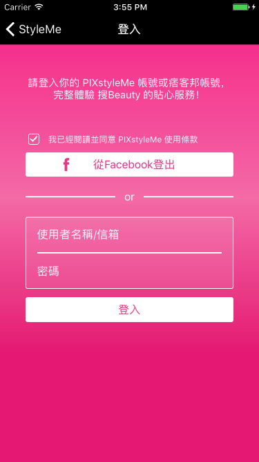
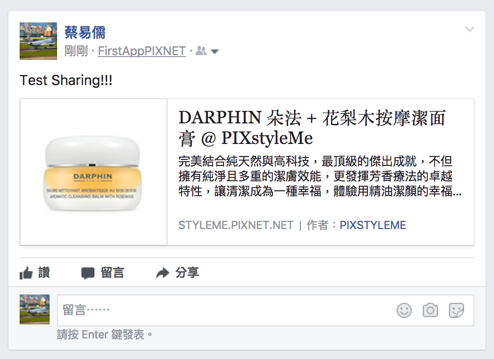

# First-App-PIXNET
First-App in PIXNET

## iOS App Developer Training - Week 01
DEMO利用Shadow提供的PIXNET API撈回所需呈現的資料。 
利用AFNetworking抓取API資料，並利用YYModel建立model -> Item 
再利用SDAutoLayout、SDWebImage將資料呈現在UITableView上 
### ListViewController
呈現商品列表（熱門、最新）兩種類別。利用Segment Control Library，操作TableView的切換 
### ItemDetailViewController
呈現商品資訊，UI呈現的部分，仿製StyleMe App。 
 
## iOS App Developer Training - Week 02
### Facebook SDK
在Facebook建立一個App - FirstAppPIXNET，加入這個部分的實作 
#### FBSDKCoreKit
利用FBSDKCoreKit所提供之API，加入App Delegate，使App可以自己Handle Facebook Login Status, UserID, Token, and etc. 
#### FBSDKLoginKit
實作StyleMe App的登入畫面，並利用FBSDKLoginKit所提供的API，取得應用程式授權 
 
除了Facebook登入按鈕，其他功能只有實作元件，並沒有串接後台 
實際操作方式為App啟動時，會再ListViewController有一個登入按鈕 
點選按鈕會跳出登入畫面，即可使用Facebook登入。登入後，會自動跳轉回原List畫面 
List畫面上的『登入』，也會隨之改變為『登出』 
點選『登出』，會Call FBSDKLoginKit API to logout，並清除儲存的Token，『登出』，也會隨之改變為『登入』。 
#### FBSDKShareKit
在商品資訊頁，加入Share Button，點按時會利用FBSDKShareKit呼叫iOS內建分享功能或Safari，並自動嵌入商品PIXstyleMe連結，使用者可以編輯分享內容後分享 
 
 
 
### 新增APNS - OpenSignal & Firebase
#### OpenSignal
加入OpenSignal-iOS-SDK到Project 
Register a new app on OpenSignal, and set AppDelegate with following code:
<pre><code>[OneSignal initWithLaunchOptions:launchOptions
                               appId:@"06201d6e-4783-4a34-9458-b50b83f5c016"];
    OneSignal.inFocusDisplayType = OSNotificationDisplayTypeNotification;
</code></pre> 
DONE!!  
You can send message from OpenSignal 
#### Firebase
首先註冊一個新的Project，Follow the guide online 
參考<a href="https://github.com/firebase/quickstart-ios/blob/master/messaging/MessagingExample/AppDelegate.m" target="_blank">這裡</a>設定AppDelegate 
DONE!!  
You can send message from Firebase 
Firebase功能很多，設定也比較繁雜，以推播通知來說，OpenSignal應該會是比較好的選項
當然如果要整合分析等等的功能，Firebase就可以多加考慮！！