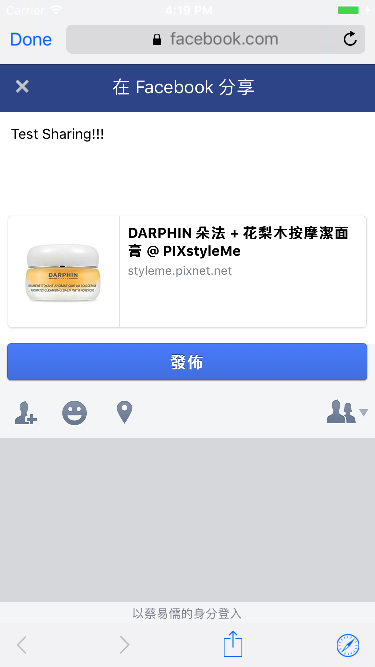

# First-App-PIXNET
App 嘗試使用各種3rd Party Library & SDK 實作未來可能會使用到的功能，參考App為PIXstyleMe App

## iOS App Developer Training - Week 01
- Use CocoaPods to manage the project
- 利用Shadow提供的PIXNET API撈回所需呈現的資料。 
- 利用AFNetworking抓取API資料，並利用YYModel建立model -> Item 
- 利用SDAutoLayout、SDWebImage將資料呈現在UITableView上 

### ListViewController
- 呈現商品列表（熱門、最新）兩種類別。利用Segment Control Library，操作TableView的切換 
### ItemDetailViewController
- 參考Zeplin UI Design from UI Design Team & Converted to the working project 
- 呈現商品資訊，UI呈現的部分，仿製StyleMe App。 

-------------------------------
## iOS App Developer Training - Week 02
### Facebook SDK
在Facebook建立一個App - FirstAppPIXNET，加入這個部分的實作 
#### FBSDKCoreKit
利用FBSDKCoreKit所提供之API，加入App Delegate，使App可以自己Handle Facebook Login Status, UserID, Token, and etc. 
#### FBSDKLoginKit
實作StyleMe App的登入畫面，並利用FBSDKLoginKit所提供的API，取得應用程式授權 
 
- 除了Facebook登入按鈕，其他功能只有實作元件，並沒有串接後台 
- 實際操作方式為App啟動時，會再ListViewController有一個登入按鈕 
- 點選按鈕會跳出登入畫面，即可使用Facebook登入。登入後，會自動跳轉回原List畫面 
- List畫面上的『登入』，也會隨之改變為『登出』 
- 點選『登出』，會Call FBSDKLoginKit API to logout，並清除儲存的Token，『登出』，也會隨之改變為『登入』。 
#### FBSDKShareKit
在商品資訊頁，加入Share Button，點按時會利用FBSDKShareKit呼叫iOS內建分享功能或Safari，並自動嵌入商品PIXstyleMe連結，使用者可以編輯分享內容後分享 
  
 
 
### 新增Apple Push Notification Service(APNS) - OpenSignal & Firebase
- 先到Apple Developer Center註冊App Bundle ID, 開啟Push Notification Service, 並設定CSR File & Download Certification File(.p12) 
- Open the Xcode Project & Open Project Setting -> Capabilities -> Turn on the Push Notifications & Background Modes(Remote notification option) 
#### OpenSignal
OpenSignal is a free Push Notification Services Provider. It can push notifications to different platforms, such as iOS, Android, or Web Services.

- 加入OpenSignal-iOS-SDK到Project 
- Register a new app on OpenSignal & Upload the Certification File(.p12)
- Set AppDelegate with following code:
<pre><code>[OneSignal initWithLaunchOptions:launchOptions
                               appId:@"*******APP_KEY_HERE*******"];
OneSignal.inFocusDisplayType = OSNotificationDisplayTypeNotification;
</code></pre> 
設定完成!! 可以開始傳送Notification囉 =D 
You can send message from OpenSignal 
#### Firebase
Firebase is the library provided by Google. It can track the usage of the app, and do the analysis. It's not only providing the notification services, but also lots of Google Services, such as AdMobs and etc.
Here we only do the notification services...

- 首先註冊一個新的Project，一樣要上傳剛剛的Certification file downloaded from Apple Developer Center 
- Download the Google Setting .plist file, and add it to the project 
- 參考<a href="https://github.com/firebase/quickstart-ios/blob/master/messaging/MessagingExample/AppDelegate.m" target="_blank">這裡</a>設定AppDelegate(設定比較複雜，所以不貼Code在這裡) 
設定完成!! 可以開始傳送Notification囉 =D 

Firebase功能很多，但是設定也比較繁雜，以推播通知來說，OpenSignal應該會是比較好的選項
當然如果要整合分析等等的功能，Firebase就可以多加考慮！！